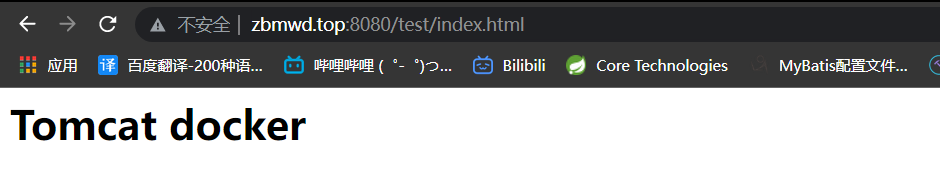

## 部署Tomcat

```shell
    docker search Tomcat // 查找tomcat包

    docker pull Tomcat // 拉取最新版
```

```shell
    // 再/root目录下创建tomcat目录用于储存tomcat数据信息
    mkdir tomcat
    cd ~/tomcat
```

```shell
    docker run -id --name=c_tomcat \
    -p 8080:8080 \
    -v $PWD:/usr/local/tomcat/webapps \
    tomcat
```

* 参数说明:
  * -p 8080:8080: 将容器的8080端口映射到主机的8080端口
  * -v $PWD:/usr/local/tomcat/webapps: 将主机中的当前目录挂载到容器的webapps

```shell
    # 创建test/index.html
    # 编写index.html
```
最后可以再网页上访问tomcat:
