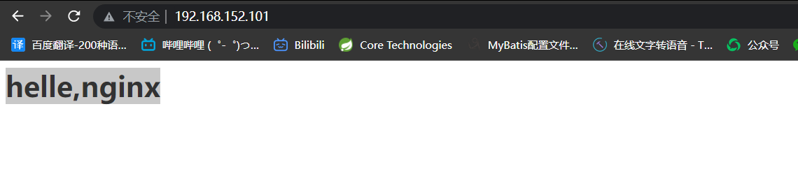

```shell
    mkdir nginx
    cd nginx
    vim nginx.conf # 这里是nginx配置
```

```shell
    docker run -id \
    --name=c_nginx \
    -p 80:80 \
    -v $PWD/conf/nginx.conf:/usr/local/webserver/nginx/conf/nginx.conf \
    -v $PWD/logs:/var/log/nginx \
    -v $PWD/html:/usr/share/nginx/html \
    nginx
```

## 访问网页



* 参数说明:
  * -p 80:80: 将容器的80端口映射到主机的80端口
  * -v : 将主机中的当前目录挂载到容器的xxx