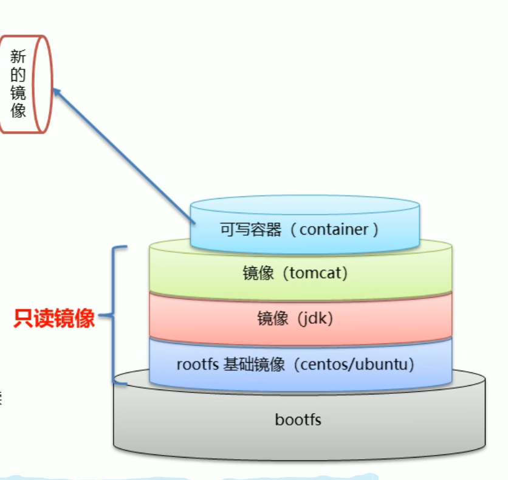

## docker镜像的原理

* docker镜像是由特殊的文件系统叠加而成
* 最低端是`bootfs`，并使用宿主机的`bootfs`
* 第二层是`root`文件系统`rootfs`,称之为`base image`
* 再往上是`可叠加`的其他镜像文件
* 同一文件系统(Union File System)技术能够将不同的层整合成一个文件系统，为这些层统一的视角，这样就隐藏了多层的存在，在用户角度看来，只存在一层文件系统
* 一个镜像上面可以放另外一个镜像。位于下方的镜像称之为`父镜像`，最底部的镜像称之为`基础镜像`
* 当镜像容器启动时，docker会在最顶层加载一个读写文件系统作为容器

